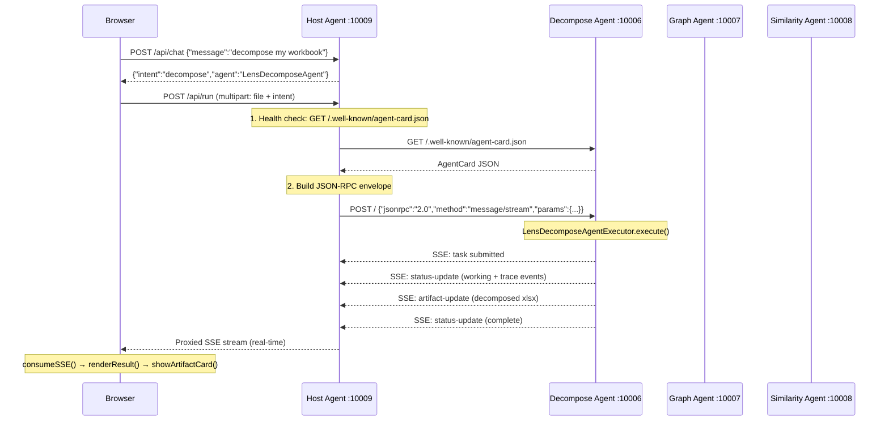

# LENS Agent System — Architecture & Communication Guide

> **Client Demo Reference** — How the Lens agents discover each other, communicate over JSON-RPC 2.0, leverage the A2A protocol, and stream intelligent responses back to the browser.

---

## Overview

The Lens system is a **multi-agent pipeline** built on the [A2A (Agent-to-Agent) protocol](https://google.github.io/A2A/). A central **Host Orchestrator** routes user requests to three specialized sub-agents. Each sub-agent is an independent HTTP microservice that exposes a JSON-RPC 2.0 endpoint, publishes an agent card for self-description, and streams results back as Server-Sent Events (SSE).

```
┌─────────────────────────────────────────────────────────────────┐
│                          CLIENT BROWSER                         │
│              http://localhost:10009/ui/                         │
└───────────────────────────┬─────────────────────────────────────┘
                            │  REST  (POST /api/run, POST /api/chat)
                            ▼
┌─────────────────────────────────────────────────────────────────┐
│              LENS HOST AGENT   :10009                           │
│         (Orchestrator — Intent Router + A2A Proxy)              │
└──────────────┬────────────────┬──────────────────┬─────────────┘
               │ JSON-RPC 2.0   │ JSON-RPC 2.0      │ JSON-RPC 2.0
               │ SSE Streaming  │ SSE Streaming     │ SSE Streaming
               ▼                ▼                   ▼
   ┌──────────────────┐ ┌──────────────────┐ ┌──────────────────┐
   │ DECOMPOSE AGENT  │ │   GRAPH AGENT    │ │ SIMILARITY AGENT │
   │    :10006        │ │    :10007        │ │    :10008        │
   │  (Agent 1)       │ │  (Agent 2)       │ │  (Agent 3)       │
   └──────────────────┘ └──────────────────┘ └──────────────────┘
```

---

## Agents at a Glance

| Agent | Port | Role | Output |
|---|---|---|---|
| **Lens Host Agent** | `10009` | Orchestrates: classifies user intent, proxies requests, streams responses | — |
| **Lens Decompose Agent** | `10006` | Decomposes test-case descriptions into ordered UI steps via LLM | `lens_decomposed_steps.xlsx` |
| **Lens Graph Agent** | `10007` | Builds a layered state-flow DAG from decomposed steps | `lens_flow_graph.html` |
| **Lens Similarity Agent** | `10008` | Computes TF-IDF cosine similarity between all test cases | `lens_tc_similarity_matrix.xlsx` |

---

## A2A Protocol — Agent Discovery

Every sub-agent advertises itself through a **well-known agent card** endpoint. The host fetches this on startup to discover agent capabilities without any hardcoded configuration.

```
GET http://localhost:10006/.well-known/agent-card.json
```

**Sample agent card response:**

```json
{
  "name": "LensDecomposeAgent",
  "version": "1.0.0",
  "description": "Decomposes automation test case descriptions into structured UI steps.",
  "capabilities": {
    "streaming": true,
    "push_notifications": false
  },
  "skills": [
    {
      "id": "lens_tc_decompose_skill",
      "name": "TC Decomposer (Agent 1)",
      "input_modes": ["text", "data", "file"],
      "output_modes": ["text", "file", "data"],
      "tags": ["lens", "automation", "decompose"]
    }
  ],
  "supported_interfaces": [
    {
      "url": "http://localhost:10006",
      "protocol_binding": "JSONRPC",
      "protocol_version": "current"
    }
  ]
}
```

The host agent uses `A2ACardResolver.get_agent_card()` from the A2A SDK, resolves each sub-agent's card, and instantiates a typed `RemoteAgentConnection` per agent — making the system **fully self-describing and dynamically composable**.

---

## JSON-RPC 2.0 — The Communication Envelope

All agent-to-agent calls are standard **JSON-RPC 2.0** messages `POST`ed to the sub-agent's root URL (`/`). The A2A SDK mounts this route automatically.

### Request

```json
POST http://localhost:10006/
Content-Type: application/json
Accept: text/event-stream, application/json

{
  "jsonrpc": "2.0",
  "id": "a3f9c1d2e4b5f678",
  "method": "message/stream",
  "params": {
    "message": {
      "role": "user",
      "messageId": "550e8400-e29b-41d4-a716-446655440000",
      "contextId": "7f3e2b1c9a0d4e5f",
      "taskId": null,
      "parts": [
        {
          "kind": "data",
          "data": {
            "entityConfig": {
              "inputs": {
                "workbook": "<base64-encoded-xlsx>"
              },
              "options": {
                "model": "gpt-4o",
                "filename": "test_cases.xlsx"
              }
            }
          }
        }
      ]
    }
  }
}
```

**Key fields:**

| Field | Purpose |
|---|---|
| `method: "message/stream"` | Triggers SSE streaming — the agent responds with a live event stream |
| `contextId` | UUID hex grouping a logical session; propagated end-to-end across all agents |
| `taskId` | Optional; set when resuming an existing task |
| `parts[].kind = "data"` | Carries structured payload (entity config, file bytes, options) |
| `enable_v0_3_compat: true` | Backward-compatible with A2A protocol v0.3 |

---

## Request Flow — End to End



### Three Paths to an Agent

**Path A — Direct sub-agent UI** (`http://localhost:10006/ui/`)
The browser posts JSON-RPC directly to the sub-agent. Useful for standalone testing of a single agent.

**Path B — Host orchestrator** (`http://localhost:10009/ui/`)
The browser sends a REST request to the host. The host classifies intent, health-checks the target agent, constructs the JSON-RPC envelope, and proxies the SSE stream back transparently.

**Path C — Google ADK orchestrator mode** (`adk web`)
The host's `LensHostAgent` class exposes ADK tools (`classify_intent_tool`, `invoke_lens_agent`) that the ADK runtime calls as part of an agent conversation loop.

---

## Response Generation & SSE Streaming

Every sub-agent uses the A2A SDK's `TaskUpdater` pattern to emit fine-grained progress events. The browser receives a live stream — no polling required.

### State Machine

```
SUBMITTED → WORKING → [trace events...] → ARTIFACT → COMPLETE
                                                     ↘ FAILED
                                                     ↘ CANCELLED
```

### SSE Event Types

**1. Task submitted**
```
data: {"jsonrpc":"2.0","result":{"kind":"task","id":"<taskId>","contextId":"<ctx>","status":{"state":"submitted"}}}
```

**2. Progress trace (emitted per LLM batch)**
```
data: {"jsonrpc":"2.0","result":{"kind":"status-update","status":{"state":"working","message":{"parts":[
  {"kind":"data","data":{"kind":"trace","phase":"lens_batch","batch_start":1,"batch_end":6,"total":24}}
]}}}}
```

**3. Artifact delivery (the output file)**
```
data: {"jsonrpc":"2.0","result":{"kind":"artifact-update","artifact":{"name":"lens_decomposed_steps.xlsx","parts":[
  {"kind":"text","text":"Decomposed 24 test cases into 186 steps across 6 LLM batches."},
  {"kind":"data","mimeType":"application/octet-stream","data":"<base64-file-bytes>"}
]}}}
```

**4. Task complete**
```
data: {"jsonrpc":"2.0","result":{"kind":"status-update","status":{"state":"completed"}}}

data: [DONE]
```

### TaskUpdater Call Sequence (sub-agent internals)

```python
# 1. Register the task
await _enqueue_initial_task(context, event_queue, task_id, context_id)

# 2. Signal start of processing
updater.submit()
updater.start_work("Processing workbook...")

# 3. Emit live trace events during LLM batches
updater.update_status(TASK_STATE_WORKING, message=[
    _trace_part({"kind":"trace","phase":"lens_batch","batch_start":1,"batch_end":6,"total":24})
])

# 4. Deliver the result file
updater.add_artifact(
    parts=[TextPart(text=summary), DataPart(data=file_b64, mimeType="application/octet-stream")],
    name="lens_decomposed_steps.xlsx",
    last_chunk=True
)

# 5. Mark complete
updater.complete("Done. 24 TCs → 186 steps.")
```

---

## Browser-Side Stream Consumption

The shared `a2a-stream.js` module handles SSE parsing in the browser:

```javascript
// consumeSSE() — reads the ReadableStream, splits on \n\n, parses JSON
async function consumeSSE(response, onEvent) {
  const reader = response.body.getReader();
  const decoder = new TextDecoder();
  let buffer = "";

  while (true) {
    const { value, done } = await reader.read();
    if (done) break;
    buffer += decoder.decode(value, { stream: true });

    const chunks = buffer.split("\n\n");
    buffer = chunks.pop();                        // keep incomplete chunk

    for (const chunk of chunks) {
      const dataLine = chunk.split("\n")
        .filter(l => l.startsWith("data:"))
        .map(l => l.slice(5).trim())
        .join("");

      if (dataLine === "[DONE]") return;
      const result = JSON.parse(dataLine);
      onEvent(result);                            // → handleStreamEvent()
    }
  }
}

// handleStreamEvent() dispatches by event kind
function handleStreamEvent(event) {
  switch (event.kind) {
    case "task":          captureTaskId(event); break;
    case "status-update": addActivity(event);   break;    // trace → progress bar
    case "artifact-update": renderResult(event); break;   // file → download card
  }
}
```

---

## LLM Configuration

The host and sub-agents share a common LLM configuration strategy:

```
Azure OpenAI  (if AZURE_OPENAI_ENDPOINT + API_KEY + DEPLOYMENT + API_VERSION are set)
      ↓ fallback
Google Gemini  (gemini-2.5-flash by default, overridable via GEMINI_MODEL env var)
```

The host uses `LiteLlm` from Google ADK. Sub-agents call `litellm.acompletion()` directly inside their `*_core.py` modules.

---

## Pipeline — Chaining Agents

The three Lens agents are designed to chain:

```
test_cases.xlsx
      │
      ▼
[Agent 1: Decompose]
      │  lens_decomposed_steps.xlsx
      ├──────────────────────────────▶ [Agent 2: Graph]
      │                                      │  lens_flow_graph.html
      └──────────────────────────────────────▶ [Agent 3: Similarity]
                                                     │  lens_tc_similarity_matrix.xlsx
```

Agent 2 and Agent 3 both accept Agent 1's output as input. Agent 3 optionally also accepts Agent 2's HTML graph for enriched context.

---

## Health Check & Agent Status

The host exposes `GET /api/status` which pings all three sub-agents and returns their online state:

```json
GET http://localhost:10009/api/status

{
  "decompose":   { "online": true,  "url": "http://localhost:10006" },
  "graph":       { "online": true,  "url": "http://localhost:10007" },
  "similarity":  { "online": false, "url": "http://localhost:10008" }
}
```

The ping is a lightweight `GET /.well-known/agent-card.json` — if the agent returns HTTP 2xx, it is considered online.

---

## Running the System

```powershell
# Start all Lens agents (PowerShell)
.\scripts\lens-dev.ps1

# Or individually
cd lens_decompose_agent  ; uv run python -m lens_decompose_agent   # :10006
cd lens_graph_agent      ; uv run python -m lens_graph_agent       # :10007
cd lens_similarity_agent ; uv run python -m lens_similarity_agent  # :10008
cd lens_host_agent       ; uv run python -m lens_host_agent        # :10009
```

Open `http://localhost:10009` to access the unified UI.

---

## Key Ports Reference

| Service | Port | UI Path | JSON-RPC Endpoint |
|---|---|---|---|
| Lens Host Orchestrator | `10009` | `/ui/` | N/A (REST proxy) |
| Lens Decompose Agent | `10006` | `/ui/` | `POST /` |
| Lens Graph Agent | `10007` | `/ui/` | `POST /` |
| Lens Similarity Agent | `10008` | `/ui/` | `POST /` |

---

*Built on the [A2A SDK](https://google.github.io/A2A/) · JSON-RPC 2.0 · Server-Sent Events · Google ADK · LiteLLM*
